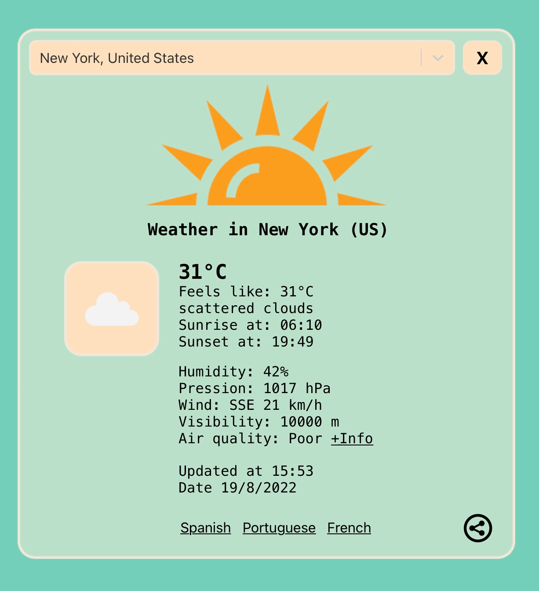
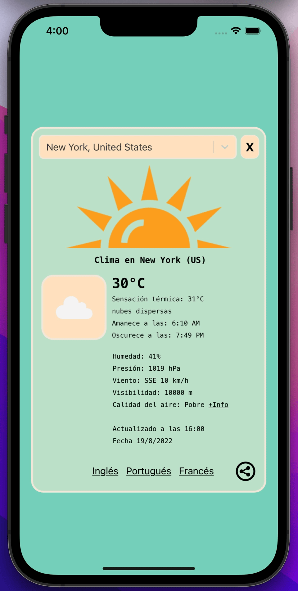

# <u> Weather4U </u>

## <b> Web version / Versión web. </b>

 

## <b> Mobile version / Versión móvil. </b>

## <u> Guide in english </u>

Application made in React JS to view the actual weather of any city of the world. Fully responsive for mobile devices.

### <u> Installation </u>

1. Clone the project or download it as a .zip file.
2. Navigate to the project directory and run `yarn install` to install the necessary dependencies.
3. Start the project with `yarn start`.
4. Enjoy real-time weather updates from any city around the globe!

#### <u> Features </u>

- Automatic updates every 10 minutes.
- Manual refresh option for quicker updates.
- Access to the Air Quality Index (AQI).
- Toggle between imperial and metric units.
- User-friendly loading spinner during fetch times.
- Search functionality for global city weather lookup.

##### <u><b> Licence </b> </u>

Made entirely by Rodolfo Agustín Silva Messano, Software Engineer from Montevideo (Uruguay).  
All rights reserved.

## <u> Guia en español </u>

Aplicación hecha en React JS para ver el clima de cualquier cuidad del mundo. Hecha responsive para dispositivos móviles.

### <u> Instalación </u>

1. Clona el proyecto o descárgalo como un archivo .zip.
2. Navega al directorio del proyecto y ejecuta `yarn install` para instalar las dependencias necesarias.
3. Inicia el proyecto con `yarn start`.
4. ¡Disfruta de actualizaciones climáticas en tiempo real de cualquier ciudad del mundo!

#### <u> Catacterísticas </u>

- Actualizaciones automáticas cada 10 minutos.
- Opción de actualización manual para actualizaciones más rápidas.
- Acceso al Índice de Calidad del Aire (AQI).
- Opción para cambiar entre unidades imperiales y métricas.
- Spinner intuitivo durante los tiempos de carga.
- Funcionalidad de búsqueda para consultar el clima de ciudades de todo el mundo.

##### <u><b> Licencia </b></u>

Hecha en su totalidad por Rodolfo Agustín Silva Messano, Ingeniero en Sistemas de Montevideo (Uruguay).  
Todos los derechos reservados.
