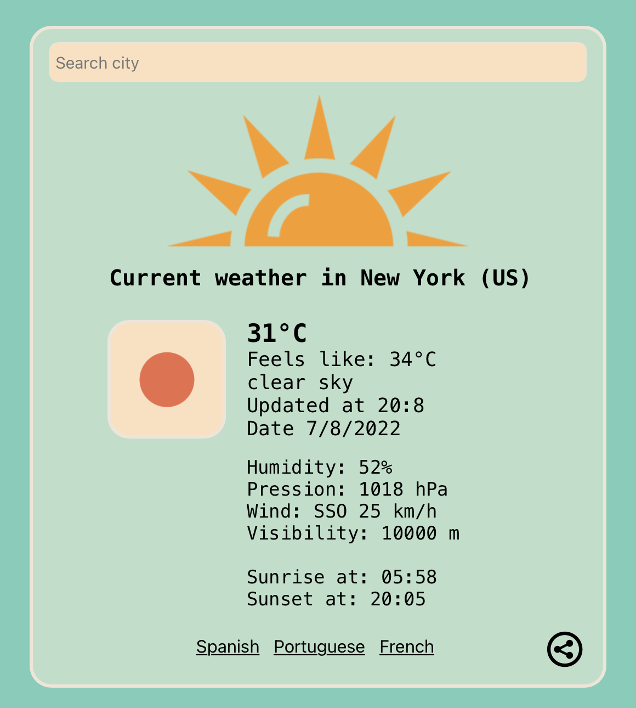
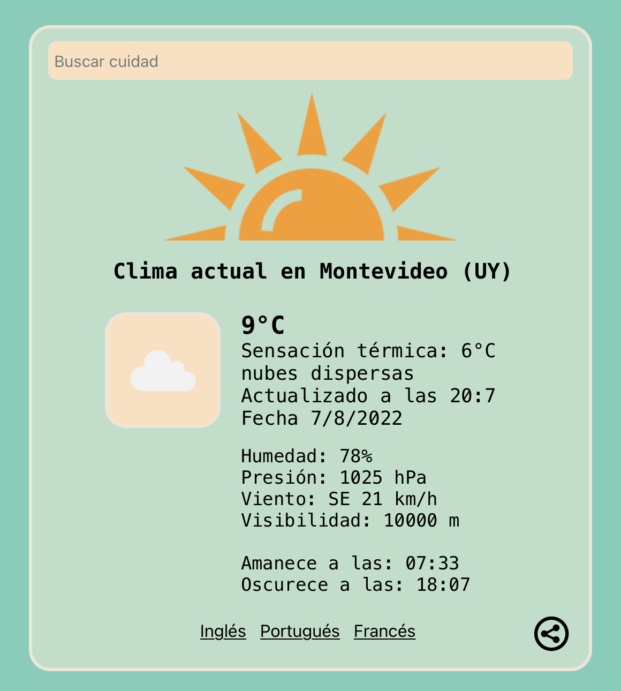
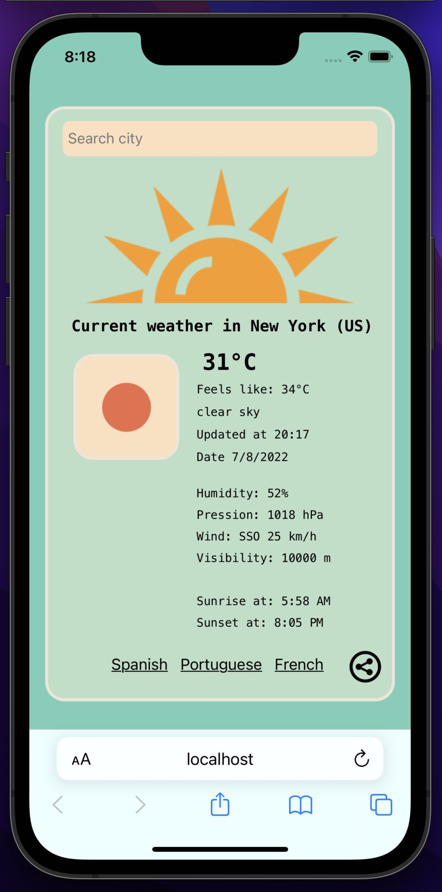
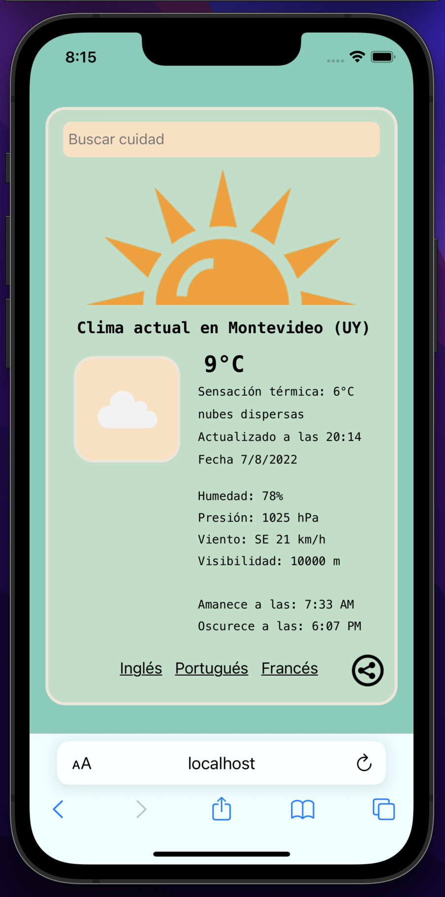

# Weather4U

Imágenes de la versión web / Images from the web version.

    
    

Imágenes de la versión móvil / Images from the mobile version.

    
    

## Guia en español
Aplicación hecha en React JS para ver el clima de cualquier cuidad del mundo. Hecha responsive para dispositivos móviles.

### Instalación
1. Clonar el proyecto o descargarlo como un .zip
2. Dentro del proyecto en la consola de comandos, escribir "yarn install" para instalar las dependencias
3. Para ejecutar el proyecto, escribir en la consola de comandos "yarn start"
4. Disfrute viendo el clima de cualquier cuidad del mundo :)

#### Catacterísticas
La aplicación se actualiza sola cada 15 minutos. 
Para actualizarla antes de los 15 minutos, refrescar el navegador web. 
Para los tiempos de carga, se muestra un spinner indicando al usuario que la aplicación esta cargando. 
Puedes buscar el clima de cualquier cuidad en la barra de búsqueda.

##### Licencia
Hecha en su totalidad por Rodolfo Agustín Silva Messano, Ingeniero en Sistemas de Montevideo (Uruguay).
Todos lo derechos reservados.

## Guide in english
Application made in React JS to view the actual weather of any city of the world. Fully responsive for mobile devices.

### Installation
1. Clone the project or download as a .zip
2. Inside the project type "yarn install" to install the dependencies
3. For running the proyect type "yarn start"
4. Enjoy watching the weather of any city of the world :)

#### Characteristics
The application updates itself every 15 minutes. 
To update before 15 minutes, refresh the web browser. 
For the loading times, a spinner is shown indicating the user that the application is loading. 
You can check the weather for any city, by searching on the top bar.

##### Licence
Made entirely by Rodolfo Agustín Silva Messano, Software Engineer from Montevideo (Uruguay).
All rights reserved.
